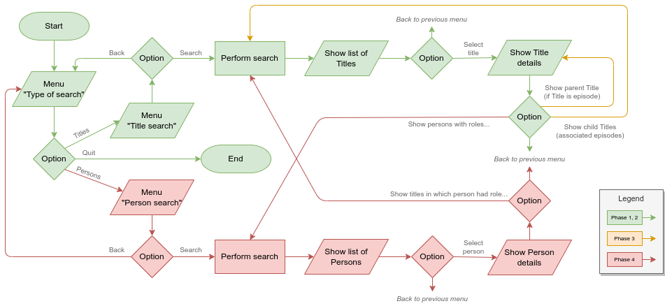

# IMDB and Linq

## Introduction

Groups should implement a C# application that performs searches in the [IMDB] database, available in the form of a [set of files][IMDBDataGz], with its documentation found [here][IMDBData].

The application can be developed on the following platforms, without any benefit or limitation in terms of grade:

1. .NET Console App
2. Unity App

However, it is a mandatory requirement of this project that the application uses [LINQ] (fluent syntax or query expressions) to perform searches.

It is necessary to go beyond what was taught in the classes about [LINQ], and the project discussion will essentially focus on how you constructed the *queries*.

## Application Operation

The application should allow searching for **titles**, and possibly **persons**, should they implement the Phase 4 of the project. A **title** is considered a cinematographic work, whether it's a movie, series, episode of a series, video, television program, and so forth. A **person** is someone who is somehow related to a title (for example, an actor).

The following flowchart presents a general idea of the application's operation, with the minimum requirements for the different phases:


The final application does not have to follow these steps exactly as long as it follows the general idea. For example, you may opt to allow ending the application at any time, and/or if you do not reach Phase 4, you can simply ignore the "Search Type" menu since you'll only be searching for titles.

The application must show the user a menu for searching titles, and if you implement Phase 4, a menu for searching persons. In any case, it should be possible to use the fields indicated in each of the development phases as search criteria. It should also be possible to use any of these fields as sorting criteria, except where indicated otherwise.

The results should appear in the form of a list, showing for each item two or three fields that are considered important. For example, in the case of titles, its type, the main title, and the release year should appear.

If the project is developed in console mode, 20 or 30 items can be displayed at a time, requiring the user to press a key to see the next 20/30 items. On the other hand, if it is a Unity project, the list of games should be scrollable up and down. It is also possible to have a scrollable list in console mode.

It should be possible to click or select one of the results in the list, in which case a new screen/window will appear showing the details of the item in question. These details are exactly those that can be searched. In phases 3 and 4, there are additional interaction possibilities when reaching this screen, as mentioned below.

## Development Phases

The project must be developed in phases. A phase is only considered completed when all previous phases have also been completed. For example, the search for persons (Phase 4) will not be evaluated if there is no link between parent and child titles (Phase 3).

### Phase 1: Basic title search

In this phase, it should be possible to perform title searches, as well as order the search results, using the following fields:

* **Type**: film, short, series, episode, etc.
* **Primary Title**: the title of the title.
* **Adults Only?**: yes or no.
* **Start Year**: the release year of the title, or in the case of a series, the year it began.
* **End Year**: in the case of a series, the year it ended.
* **Genres**: up to three genres associated with the title (e.g. comedy, action, etc.). This field may not be used as a sorting criterion.

In the case of **type** and **genres**, solutions that allow the user to choose only from the types and/or genres existing in the database will be valued.

Implementing this phase is the minimum requirement for the project to be evaluated, allowing a grade up to 1.8 points (out of 3 possible).

### Phase 2: Title search with rating

Besides the requirements of Phase 1, it should also be possible to perform title searches, as well as order the search results, using the **Rating**, between 0 to 10, assigned to the title.

Implementing this phase allows a grade up to 2.2 points (out of 3 possible).

### Phase 3: Connection between series and their respective episodes

Besides the requirements of the previous phases, the parent titles must be explicitly related to the child titles. This is the case with series and their episodes.

Practically speaking, the information screen of a child title should also display the following information:

* **Parent Title Name** (e.g., series name)
* **Season**
* **Episode Number**

Additionally, the user should have the option to directly view the information screen of the parent title.

On the information screen of a parent title, there should be the additional option to perform an automatic search for the respective child titles. In the scrollable list that will then appear with the results of this search, the user will naturally be able to click/select one of these child titles, consequently displaying an information screen about the selected child title (which in turn has the option to directly view the information screen of the parent title, and so forth).

Implementing this phase allows a grade up to 2.6 points (out of 3 possible).

### Phase 4: Person search

Besides the requirements of the previous phases, a search for persons must also be implemented, as well as establishing a relationship between titles and persons.

The search for persons should be performed using the following fields, which also serve as sorting criteria (except where indicated otherwise):

* **Name**
* **Year of Birth**
* **Year of Death**
* **Main Professions**, not necessary as a sorting criterion.

In the case of **main professions**, solutions that allow the user to choose only among the professions existing in the database will be valued.

The user will be able to select a person from the list of results, displaying an information screen with the respective person's details. On this screen, the user has an additional option, which consists of requesting an automatic search on the titles in which the person participated. In the presentation of these results (list of titles in which the person participated), it must also appear for each title what was the profession/role played by the person in question. As with any listing of titles, the user should have the possibility to select one of these titles to view its detailed information, and so forth.

Note that the *knownForTitles* data field does not contain all the titles in which a person participated and should be ignored in this project.

Implementing this phase allows for the maximum grade of 3 points.


## Data Files

### Where to Place the Files

The data is distributed across [several files][IMDBDataGz] compressed in the `GZip` format. These files should be placed in the `MyIMDBSearcher` folder, which in turn should exist in the computer's local applications directory, typically `C:\Users\YourUsername\AppData\Local` on Windows or `/home/YourUsername/.local/share` on Linux. For example, on Windows, the complete path of the file `title.ratings.tsv.gz` should be `C:\Users\YourUsername\AppData\Local\MyIMDBSearcher\tile.ratings.tsv.gz`, although there may be differences in terms of the drive (which may not be `C:`), and certainly in terms of the user name.

The files cannot be modified, neither by your application nor manually. At no time should the files be placed in the project folder, much less added to the Git repository.

### File Format

The files are compressed in the `GZip` format, and it is in this format that they must be used by the application being developed. When decompressed, they are simple text files in the [TSV] format. In the [TSV] format, each line corresponds to a data entry, except for the first line, which contains the data header (in other words, the name of each column).

The description of the content of each of these files, as well as how they relate to each other, is described on the [respective IMDB page][IMDBData].

To successfully develop the project, it is essential that this documentation, as well as the files themselves, be carefully studied. A quick way to view the contents of the compressed files is to use the following command:

`gzip -c -d title.episode.tsv.gz | less`

This command works in the Git Bash console on Windows and in the terminal on Linux (it does not work in CMD or PowerShell). You should replace the file name with the file you intend to analyze, and also be in the same folder where the files are located, making the necessary `cd` commands for that. If you decompress the files and try to open them in an editor, it is likely that the editor will _crash_ due to its size. Choose an editor capable of doing so, such as Visual Studio Code with the [Rainbow CSV] extension (which also supports the [TSV] format).

### How to Open the Files in the Developed Application

Since the application must work on different operating systems, you should use the utility methods and properties provided by the [`Environment`] and [`Path`] classes to obtain the complete path of these files. For example:

```csharp
/// At the class level
private const string appName = "MyIMDBSearcher";
private const string fileTitleBasics = "title.basics.tsv.gz";
private const string fileTitleRatings = "title.ratings.tsv.gz";
// etc...
```

```csharp
/// At the method level
// Complete path to the folder containing the data files
string folderWithFiles = Path.Combine(
    Environment.GetFolderPath(Environment.SpecialFolder.LocalApplicationData),
    appName);

// Complete path for each of the data files
string fileTitleBasicsFull = Path.Combine(folderWithFiles, fileTitleBasics);
string fileTitleRatingsFull = Path.Combine(folderWithFiles, fileTitleRatings);
// etc...
```

The application should open the compressed files directly, using the [appropriate stream decorator from the C# API][GZipStream], so that the [StreamReader] adapter can read the uncompressed text (in the [TSV] format).

If any necessary file does not exist or has an invalid format, the application must terminate with an appropriate error message.

### Optimization Suggestions

The data files are quite large, however, the application to be developed cannot use more than 6 gigabytes of memory, with projects that require less memory being rewarded. There are various techniques that can and should be used to keep memory usage under control, including:

* Depending on the phase you reach, you may only need one or two files. Do not open/read files whose information you will not use.
* Many of the fields present in each line are also not necessary and should be ignored in order to save memory.
* Use the most appropriate and "smallest" possible types for each of the fields. For example, is it really necessary to use an `int` to represent the release year?
* Consider pre-allocating the collections you will use with the exact size necessary to store their respective data. For example, lists have a [constructor][ListSizeCtor] that accepts the initial size of the list as a parameter, and arrays are always pre-allocated.
* If well used, structs can save memory compared to classes.
* In Unity, when presenting the results of a given search, be careful with the number of results you inject into the UI. Too many results can impair performance and even crash the application. [LINQ] has ways to return only a few results at a time, avoiding this situation.
* Both Unity and native C# offer ways to analyze the amount of memory occupied. Use this functionality during the development of the project to be aware of the memory you are using. For example, using native C# functionality:
  ```csharp
  using System.Diagnostics;
  //...
  Console.WriteLine("My app is occupying "
    + (Process.GetCurrentProcess().VirtualMemorySize64 / 1024 / 1024)
    + " megabytes of memory");
  ```

## Project Organization and Class Structure

The project must be properly organized, making use of classes, `structs`, and/or enumerations, as appropriate. Each type (i.e., class, `struct`, or enumeration) should be placed in a file with the same name. For example, a class called `Title` should be placed in the file `Title.cs`.

In turn, the choice of the collection or collections to use should also be appropriate for the problem.

The class structure must be well thought out and organized in a logical manner, making use of *design patterns* when and if appropriate. In particular, the project should be developed taking into account the principles of object-oriented programming, such as, among others, the [SOLID] principles.

These principles must be balanced with the [KISS] principle, crucial in the development of any application.

It is worth highlighting that the use of LINQ, Lambdas, and *nullables* is essential in this project.

## Example

The [`sample`](sample) folder contains a small example with suggestions on how to implement some specific parts of the project. This example is merely illustrative and may offer some help for Phase 1, although not necessarily using the best approaches and principles. In addition, it does not include important code at the LINQ level for later phases, namely the [Join()] method (also available in the form of [query expression][join]).

## Objectives and Evaluation Criteria

This project has the following objectives:

* **O1** - The program should work as specified.
* **O2** - The project and code well organized, namely:
  * Well-thought-out class structure (see [Project Organization and Class Structure][orgclasses] section).
  * Properly commented and indented code.
  * No "dead" code that does nothing, such as variables, properties, or methods never used.
  * Project compiles and executes without errors and/or *warnings*.
* **O3** - The project appropriately documented. Documentation should be made with [XML documentation comments][XML].
* **O4** - The Git repository must reflect good use of it, with *commits* from all group members and *commit* messages that follow the best practices for the purpose (as indicated [here](https://chris.beams.io/posts/git-commit/), [here](https://gist.github.com/robertpainsi/b632364184e70900af4ab688decf6f53), [here](https://github.com/erlang/otp/wiki/writing-good-commit-messages) and [here](https://stackoverflow.com/questions/2290016/git-commit-messages-50-72-formatting)). Any binary *assets*, such as images, should be integrated into the repository in Git LFS mode.
* **O5** - Report in [Markdown] format (file `README.md`), organized as follows:
  * Project title.
  * Authorship:
    * Names of the authors (first and last) and their respective student numbers.
    * Information on who did what in the project. This information is **mandatory** and must reflect the *commits* made in Git.
    * Indication of the public Git repository used. This indication is optional, as you may prefer to develop the project in a private repository.
  * Solution architecture:
    * Solution description, with a brief explanation of how the program was organized, indication of the collections used and why, as well as the algorithms used (e.g., for parsing TSV files), the main *queries* constructed, as well as the specific optimizations implemented.
    * A simple UML class diagram (i.e., without indicating the class members) describing the class structure.
  * References, including idea exchanges with colleagues, reused open-source code (e.g., from StackOverflow), and third-party libraries used. They should be as detailed as possible.
  * **Note:** The report should be simple and brief, with minimal and sufficient information so that it is possible to have a good idea of what was done. Attention to spelling errors and correct [Markdown] formatting,

## References

* \[1\] Whitaker, R. B. (2016). **The C# Player's Guide** (3rd Edition). Starbound Software.
* \[2\] Albahari, J. (2017). **C# 7.0 in a Nutshell**. O’Reilly Media.
* \[3\] IMDB (2019). **IMDb Datasets**. Retrieved from <https://www.imdb.com/interfaces/>.
* \[4\] Freeman, E., Robson, E., Bates, B., & Sierra, K. (2004). **Head First Design Patterns**. O'Reilly Media.
* \[5\] Dorsey, T. (2017). **Doing Visual Studio and .NET Code Documentation Right**. Visual Studio Magazine. Retrieved from <https://visualstudiomagazine.com/articles/2017/02/21/vs-dotnet-code-documentation-tools-roundup.aspx>.

## Licenses

* This assignment is made available through the [CC BY-NC-SA 4.0] license.
* The example code is made available through the [MIT] license.

## Metadata

- Author: [Nuno Fachada]
- Affiliation: [Lusófona University, COPELABS][ULHT]

[LINQ]:https://docs.microsoft.com/en-us/dotnet/csharp/programming-guide/concepts/linq/introduction-to-linq-queries
[CC BY-NC-SA 4.0]:https://creativecommons.org/licenses/by-nc-sa/4.0/
[MIT]:https://opensource.org/license/MIT
[lamv]:https://www.ulusofona.pt/licenciatura/videojogos
[Nuno Fachada]:https://github.com/fakenmc
[ULHT]:https://www.ulusofona.pt/
[aed]:https://fenix.tecnico.ulisboa.pt/disciplinas/AED-2/2009-2010/2-semestre/honestidade-academica
[ist]:https://tecnico.ulisboa.pt/pt/
[Markdown]:https://guides.github.com/features/mastering-markdown/
[SOLID]:https://en.wikipedia.org/wiki/SOLID
[KISS]:https://en.wikipedia.org/wiki/KISS_principle
[TSV]:https://en.wikipedia.org/wiki/Tab-separated_values
[XML]:https://docs.microsoft.com/dotnet/csharp/codedoc
[`Process`]:https://docs.microsoft.com/dotnet/api/system.diagnostics.process
[IMDB]:https://www.imdb.com/
[IMDBData]:https://www.imdb.com/interfaces/
[IMDBDataGz]:https://datasets.imdbws.com/
[`Environment`]:https://docs.microsoft.com/dotnet/api/system.environment
[`Path`]:https://docs.microsoft.com/dotnet/api/system.io.path
[Rainbow CSV]:https://marketplace.visualstudio.com/items?itemName=mechatroner.rainbow-csv
[GZipStream]:https://docs.microsoft.com/dotnet/api/system.io.compression.gzipstream
[StreamReader]:https://docs.microsoft.com/dotnet/api/system.io.streamreader
[ListSizeCtor]:https://docs.microsoft.com/dotnet/api/system.collections.generic.list-1.-ctor#System_Collections_Generic_List_1__ctor_System_Int32_
[Join()]:https://docs.microsoft.com/dotnet/api/system.linq.enumerable.join
[join]:https://docs.microsoft.com/dotnet/csharp/language-reference/keywords/join-clause
[2º projeto de LP1 2018/19]:https://github.com/VideojogosLusofona/lp1_2018_p2_solucao
[fases de desenvolvimento]:#fases-de-desenvolvimento
[Fase 1]:#fase-1-pesquisa-de-títulos-básica
[Fase 2]:#fase-2-pesquisa-de-títulos-com-classificação
[Fase 3]:#fase-3-ligação-entre-séries-e-os-respetivos-episódios
[Fase 4]:#fase-4-pesquisa-de-pessoas
[orgclasses]:#organização-do-projeto-e-estrutura-de-classes
[objetivos]:#objetivos-e-critério-de-avaliação
