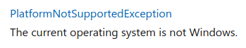

# NASA Exoplanets DB

## Introduction

Groups should implement a C# application that performs searches in the [NASA exoplanets database][NASAexo], available in a [CSV] file format.

The application can be developed on the following platforms, without any benefits or limitations in terms of grade:

1. .NET Console App
2. Unity App

However, it is a mandatory requirement of this project for the application to use [LINQ] (fluent syntax or query expressions) for conducting the searches.

It is necessary to go beyond what was taught in the classes about [LINQ], and the project discussion will essentially focus on how you constructed the *queries*.

## Application Operation

The application's standard phase should allow for searches for **planets** and **stars** separately, and will have a maximum grade of 2.5 (out of 3 possible). The [advanced phase](#advanced-phase) requires that searches can be done with fields from both planets and stars at the same time (for example, listing all planets orbiting a star 10x larger than the sun).

The implementation can be interactive (Unity or console) or non-interactive (console only), as described in [Implementation Forms](#implementation-forms). In any case, the standard (non-advanced) phase should have the following functionalities:

* Open the data file and create a collection of planets and a collection of stars. The data for each star should be obtained from the data file based on the planets that orbit it (see section [Fields of Interest](#fields-of-interest)).
* Conduct searches for planets using specific planet fields.
* In the [advanced phase](#advanced-phase), it should also be possible to include star fields in the planet searches.
* Conduct searches for stars using specific star fields and also by the number of planets in the star.
* In the [advanced phase](#advanced-phase), it should also be possible to include planet fields in the star searches.
* Numerical fields should allow specifying a minimum and a maximum search value.
* Text fields should check if the search value is a _substring_ of the respective field of the planets or stars, and this search should be case-independent.
* If a user does not specify any of the search fields, the application should assume that there is no restriction (being possible, for example, to specify only a minimum value for a given field and not the maximum).
* It should be possible to sort the search results by any of the used fields, both in ascending and descending order.
* Solutions that allow for a secondary sorting criterion (used when there is a tie in the primary criterion) will be valued.
* View detailed information about a planet.
* View detailed information about a star.
* Not _crash_ with exceptions, but elegantly show the user possible errors that may occur (for example, when reading the file).

### Implementation Forms

The application can be implemented interactively (Unity or console) **or** non-interactively (console only), as described in the following sections.

#### Interactive Application

In the interactive implementation (in Unity or console), a dialog box should initially appear where the user can specify the file to open. Once the file is successfully opened, options to search planets and search stars should appear. Selecting one of the search options, a UI should then appear that allows specifying the various fields to filter, as well as indicating the sorting criterion(s). Ideally, this UI will have space for presenting the results, being possible to change search and sorting criteria and see the results on the same screen/window.

The results should appear in the form of a list, showing all the fields for each item. In the case of planets, information about the star should be limited to its name. In the case of stars, information about their planets should be summarized by their quantity. If the project is developed in console, 20 or 30 items can be displayed at a time, requiring the user to press a key to see the next 20/30 items. On the other hand, if it is a Unity project, the list of games should be scrollable up and down. It is also possible to have a scrollable list in console mode.

It should be possible to click or select one of the results from the list, in which case a new screen/window should appear showing the details (fields) of the item in question, in extended form and showing the units (e.g. km/s) in the case of numerical fields. In the case of the planet information screen/window, complete information about the orbiting star should now appear. In the case of the star information screen/window, a list of the names of planets that orbit it should appear.

At any moment, it should be possible to go back (including opening a new file), as well as to exit the application.

#### Non-interactive Console Application

In this version, the application does not have any UI, functioning entirely with options passed on the command line. It should have all the functionalities indicated in [Application Operation](#application-operation), writing all its _output_ in the terminal, sequentially and without stops. Some examples assuming the project is called `AstroFinder` (the exact name of the options is up to the group, but they should be obvious):

```bash
# Search for planets with a temperature between 150 and 400 Kelvin and smaller
# than Earth
dotnet run --project AstroFinder -- search-planets --file nome_do_ficheiro.csv --eqt-min 150 --eqt-max 400 --rade-max 1.0
# Search for stars older than 2 billion years and at a maximum
# distance of 5 parsecs from the solar system
dotnet run --project AstroFinder -- search-stars --file nome_do_ficheiro.csv --age-min 2.0 --dist-max 5.0
# Search for planets discovered by the transit method until the year 2010
dotnet run --project AstroFinder -- search-planets --file nome_do_ficheiro.csv --method "transit" --year-max 2010
# Shows information about planet Proxima Cen b (the closest known exoplanet
# to Earth)
dotnet run --project AstroFinder -- search-planets --file nome_do_ficheiro.csv --pl_name "proxima cen b"
```

By default, the _output_ should appear formatted and easy to read, in list form, and should contain all fields of interest similar to the [interactive application](#interactive-application), i.e.:

> The results should appear in the form of a list, showing all the fields
> for each item. In the case of planets, the information about the star should
> be limited to its name. In the case of stars, the information about their
> planets should be summarized by their quantity.

In the case of the last command given as an example, the output could be something like:

```bash
Planet name   Star name     Disc. method      Year   Orbital Radius    Mass   Eq. Temp.   Period (days)   (vs Earth)   (vs Earth)   (Kelvin)
----------------------------------------------------------------------------------------------------------------------------------------------------------------
Proxima Cen b   Proxima Cen   Radial Veloc...   2016    11.186   N/A   N/A   234
```

There should also be an option (for example, `--csv`) to format the data exactly according to the file's input format. In the previous case, it would be:

```bash
pl_name,hostname,discoverymethod,disc_year,pl_orbper,pl_rade,pl_masse,pl_eqt
Proxima Cen b,Proxima Cen,Radial Velocity,2016,11.186,,,234
```

Note that it's not necessary to save this output to a file. For that, it would be enough to run the application as follows (repeating the previous example):

```bash
dotnet run --project AstroFinder -- search-planets --file nome_do_ficheiro.csv --pl_name "proxima cen b" --csv > output.csv
```

It should be possible to reopen the file created with the application, except in the case of the star search, which would generate an incompatible file.

If the group opts for the non-interactive implementation, there should be a default help that describes all possible options. Additionally, the report should contain a table with the description of these options.

A flexible approach to command-line options handling is available in the [2nd LP1 project 2018/19]. A more advanced option, but much more practical after the learning curve, is to use the [Command Line Parser][CLParserLib] library, which works with attributes. To make use of this library, just run the following command in your project folder (i.e., in the folder that contains the `.csproj` file):

```bash
dotnet add package CommandLineParser --version 2.8.0
```

From that moment on, you can use the namespaces of the library.

### Advanced Phase

The advanced phase of the project allows surpassing the limitation of 2.5 points. In this phase, searches for planets must include fields belonging to stars and vice versa. Some examples:

* Search for planets with a temperature below 1000K and whose star is older than 1.5 billion years.
* Search for stars with a radius between 0.5 to 1.5 solar radii which have planets with temperatures between 200 and 300K.

To perform this type of searches, it may be necessary to use the [Join()] method (also available in the form of a [query expression][join]), depending on how the application is structured. Note that it is perfectly possible to have an excellent solution without the use of this method.

Additionally, if the interactive version is implemented, the following functionalities should be implemented:

* On the screen/window that shows detailed information about a planet, there should be the option to view the details of the associated star (opening a new screen/window with information about the star).
* On the screen/window that shows detailed information about a star, there should be the option to view a list of associated planets, effectively conducting a search for planets that belong to that star.
* This functionality is iterative or recursive, allowing the user to go back and forth in these screens and searches.

### Compatibility

If it is implemented in console, the application should work on Windows, macOS, and Linux. The best strategy to ensure this is to test the application on Linux (e.g., in a virtual machine). Some instructions incompatible with macOS and Linux are, for example:

* [Console.Beep()](https://docs.microsoft.com/dotnet/api/system.console.beep)
* [Console.SetBufferSize()](https://docs.microsoft.com/dotnet/api/system.console.setbuffersize)
* [Console.SetWindowPosition()](https://docs.microsoft.com/dotnet/api/system.console.setwindowposition)
* [Console.SetWindowSize()](https://docs.microsoft.com/dotnet/api/system.console.setwindowsize)
* Among others.

Instructions that only work on Windows have the following indication in their documentation:


Unity projects generally work well on Linux and macOS, even when developed on Windows.

## Data File

### How to Obtain

The file with the data on exoplanets should be obtained [at this link][NASAexoData], in the "Download Table" menu, selecting the following options:

* _CSV Format_
* _Download All Columns_
* _Download Checked (and Filtered) Rows_
* _Values Only (no errors, limits, etc.)_

The file is downloaded by clicking the _Download Table_ option.

There are also included several [test files](input_tests) in this repository, half of which are valid (see next section).

### File Format

The file can have comments (lines that start with a cardinal, `#`) and blank lines. Both should be ignored.

The first line of data (that is not a comment or a blank line) contains the header, i.e., the name of the columns/fields, separated by commas. The following data lines contain the data for each individual exoplanet and its star, these data being separated by commas. The fields/columns can appear in any order, an order that is defined by the name of the fields in the header.

### Fields of Interest

The application should only consider the following fields/columns, ignoring the rest:

* `pl_name` - Name of the planet.
* `hostname` - Name of the star which the planet orbits.
* `discoverymethod` - Discovery method.
* `disc_year` - Year of discovery.
* `pl_orbper` - Orbital period (in days).
* `pl_rade` - Radius of the planet (in comparison to Earth).
* `pl_masse` - Mass of the planet (in comparison to Earth).
* `pl_eqt` - Equilibrium temperature of the planet (in Kelvins).
* `st_teff` - Effective temperature of the star (in Kelvins).
* `st_rad` - Radius of the star (in comparison to the Sun).
* `st_mass` - Mass of the star (in comparison to the Sun).
* `st_age` - Age of the star (in Giga-years, i.e., by billion years).
* `st_vsin` - Rotation speed of the star (in km/s).
* `st_rotp` - Rotation period of the star (in days).
* `sy_dist` - Distance between the Sun and the star (in Parsecs, being 1 Parsec ≈ 3.26 light-years).

The star-related fields refer to the star that the planet orbits. This information can appear repeated because several planets can orbit the same star. There are situations where:

1. The information about the star is contradictory (slightly different temperatures, etc.).
2. Some fields of the star are associated with one of its planets but not with others.

In the first case, the application can choose to use the first valid information it finds or replace it as new planets belonging to the same star appear. In the second case, the application should try to compile as much information about the star as possible, even if this information comes from different planets that orbit it.

In any case, the number of planets a star has must be obtained from the number of planets actually read from the file that belongs to that star, and the `sy_pnum` field should be ignored, if present in the file.

### How to Open for Viewing

The file can be opened (for viewing only) in Visual Studio Code with the [CSV Rainbow] extension, configured as follows (_"File => Preferences => Settings"_):

* Editor: Large File Optimizations => OFF
* Rainbow_csv: Comment_prefix => #

With the file open, you can click on the blue bar below where it says "Align" to align the columns, making viewing easier (and then "Shrink" to return to the original format).

It is also possible to open the file for viewing in [LibreOffice Calc], choosing only "Comma" (or "Vírgula") as a separator.

The file must not be altered by the application being developed, although it may be altered externally (e.g., with Visual Studio Code) for testing purposes.

Data files **should not be included in the project delivery**, **nor in any way added to the Git repository**. Projects that do not comply with this rule will not be evaluated.

### How to Open the Files in the Developed Application

* The application must ignore comments (lines starting with `#`), as well as blank lines.
* The application must be capable of opening files with fewer or more columns, considering only the [columns of interest](#fields-of-interest).
* The application must ignore columns that are not of interest.
* The application must be capable of opening the file regardless of the order of the columns. That is, the application should not expect the columns to be in a certain order.
* The minimum mandatory information for the file to be considered valid is provided by the following columns:
  * `pl_name`: Name of the planet.
  * `hostname`: Name of the star that contains the planet. The file should be considered invalid if it does not have these two columns.
* If the file is missing any column of interest, the application should consider that this information does not exist for all planets and/or stars.
* If any field is empty for a given planet/star, the application must consider that this information does not exist for that particular planet (or star).
* Each field of interest that is available must be convertible to its expected type (for example, if the year of discovery is represented by letters and not digits). Otherwise, the file should be considered invalid.
* See the section [Conversion and Printing of Real Numbers](#conversion-and-printing-of-real-numbers) to ensure that real numbers are converted appropriately.
* The file must also be considered invalid if the number of fields in some of the lines does not correspond to the number of columns indicated in the header (header that contains the name of the fields).
* If the specified file has an invalid format, the application should show an appropriate error message.

### Tips and Suggestions

### Project Organization and Class Structure

The application should be fully implemented by objects, having collections of planets and stars.

The project must be properly organized, making use of classes, `structs`, and/or enumerations, as appropriate. Each type (i.e., class, `struct`, or enumeration) should be placed in a file with the same name. For instance, a class called `Star` should be placed in the file `Star.cs`.

In turn, the choice of the collection or collections to use should also be appropriate for the problem.

The class structure should be well thought out and logically organized, making use of *design patterns* when and if appropriate. In particular, the project should be developed taking into account the principles of object-oriented programming, such as the [SOLID] principles, among others.

These principles must be balanced with the [KISS] principle, crucial in the development of any application.

It is worth noting that the use of LINQ, Lambdas, and *nullables* is essential in this project.


### Suggestion for Project Architecture

Whether in console or Unity, a good model to start organizing the classes for this project is the following:

* A central controller class that guides the program. Everything that happens in the program departs from this class.
* A class exclusively dedicated to UI.
* A class whose responsibility is only to open the file and produce the necessary collections of planets and stars.
* A class whose sole responsibility is to perform _queries_ and return the results.

This suggestion is just a starting point, as more classes/types might be needed to achieve good architecture. Depending on the implementation, it is also possible to achieve good designs with slightly different approaches.

### Optimization Suggestions

The data file can be large, so it may be useful to make some optimizations. There are various techniques that can and should be used for this purpose, including:

* Fields existing in each line that are not necessary should be ignored.
* Appropriate and the smallest possible types for each of the fields should be used. For example, is it really necessary to use an `int` to represent the year of discovery?
* The collections used to store the data should be pre-allocated with the exact size necessary. For example, lists have a [constructor][ListSizeCtor] that accepts the initial size of the list as a parameter, and arrays are always pre-allocated.
* In Unity, when presenting the results of a given search, care must be taken with the number of results injected into the UI. Too many results can impair performance and even crash the application. [LINQ] has ways to return only a few results at a time, avoiding this situation.

### Conversion and Printing of Real Numbers

In order to convert a _string_ into a real number (in this case, a `double`), one of the following approaches is typically used:

```csharp
// s is a string, x is a double
x = Convert.ToDouble(s); // Approach 1
x = double.Parse(s); // Approach 2
double.TryParse(s, out x); // Approach 3 (preferred)
```

The last form is preferred, as it allows us to check if the conversion was invalid. However, a problem may occur if the PC is configured with the Portuguese language, in which the decimal separator is a comma and not a point.

To avoid this problem, we can indicate to C# that we want a conversion independent of the computer's configured language, assuming a point as the decimal separator:

```csharp
// Requires an extra using at the beginning of the class
using System.Globalization;
//...
// s is a string, x is a double
x = Convert.ToDouble(s, CultureInfo.InvariantCulture); // Approach 1
x = double.Parse(s, NumberStyles.Any, CultureInfo.InvariantCulture); // Approach 2
double.TryParse(s, NumberStyles.Any, CultureInfo.InvariantCulture, out x); // Approach 3 (preferred)
```

Note that the approach with `TryParse()` is usually used with an `if`:

```csharp
if (double.TryParse(...))
{
    // Conversion successful
}
else
{
    // Conversion failed
}
```

There may be a similar problem in printing real numbers, which may be relevant in the non-interactive console version with the `--csv` option. In that case, real numbers must be explicitly converted to `string` before being printed. For example:

```csharp
// Requires an extra using at the beginning of the class
using System.Globalization;
//...
// Prints 4.5 if the computer is configured in Portuguese
Console.WriteLine(4.5f);
// Prints 4.5 regardless of the computer's locale
Console.WriteLine(4.5f.ToString(CultureInfo.InvariantCulture));
```

## Objectives and Evaluation Criteria

This project has the following objectives:

* **O1** - The program must work as specified.
* **O2** - The project and code well organized, namely:
  * Well-thought-out class structure (see "Project Organization and Class Structure" section).
  * Properly commented and indented code.
  * No "dead" code that does nothing, such as unused variables, properties or methods.
  * The project compiles and executes without errors and/or *warnings*.
* **O3** - The project appropriately documented. Documentation should be done with [XML documentation comments][XML].
* **O4** - The Git repository must reflect good use of it, with *commits* from all group members and *commit* messages that follow the best practices for the purpose (as indicated [here](https://chris.beams.io/posts/git-commit/), [here](https://gist.github.com/robertpainsi/b632364184e70900af4ab688decf6f53), [here](https://github.com/erlang/otp/wiki/writing-good-commit-messages) and [here](https://stackoverflow.com/questions/2290016/git-commit-messages-50-72-formatting)). Any binary *assets*, such as images, should be integrated into the repository in Git LFS mode.
* **O5** - The report in [Markdown] format (file `README.md`), organized as follows:
  * The project title.
  * Authorship:
    * Names of the authors (first and last) and respective student numbers.
    * Information on who did what in the project. This information is **mandatory** and must reflect the *commits* made in Git.
    * Indication of the public Git repository used. This indication is optional, as you may prefer to develop the project in a private repository.
  * Solution architecture:
    * Indication of the implementation form (interactive Unity/console or non-interactive console).
    * Description of the solution, with a brief explanation of how the program was organized, indication of the collections used and why, as well as the algorithms used (e.g., for parsing the CSV file), the main *queries* built, as well as the specific optimizations implemented.
    * A simple UML class diagram (i.e., without indicating the class members) describing the class structure.
  * References, including idea exchanges with colleagues, reused open-source code (e.g., from StackOverflow), and used third-party libraries. They should be as detailed as possible.
  * **Note:** The report should be simple and brief, with minimal and sufficient information for it to be possible to get a good idea of what was done. Attention to spelling errors and correct [Markdown] formatting, as both will be considered in the final grade.

## References

* \[1\] Whitaker, R. B. (2016). **The C# Player's Guide** (3rd Edition). Starbound Software.
* \[2\] Albahari, J. (2017). **C# 7.0 in a Nutshell**. O’Reilly Media.
* \[3\] NASA (2020). **NASA Exoplanet Archive**. Retrieved from <https://exoplanetarchive.ipac.caltech.edu/index.html>.
* \[4\] Freeman, E., Robson, E., Bates, B., & Sierra, K. (2004). **Head First Design Patterns**. O'Reilly Media.
* \[5\] Dorsey, T. (2017). **Doing Visual Studio and .NET Code Documentation Right**. Visual Studio Magazine. Retrieved from <https://visualstudiomagazine.com/articles/2017/02/21/vs-dotnet-code-documentation-tools-roundup.aspx>.

## Licenses

* This assignment is made available through the [CC BY-NC-SA 4.0] license.
* The example code is made available through the [MIT] license.

## Metadata

- Author: [Nuno Fachada]
- Affiliation: [Lusófona University, COPELABS][ULHT]

[MIT]:https://opensource.org/license/MIT
[LINQ]:https://docs.microsoft.com/en-us/dotnet/csharp/programming-guide/concepts/linq/introduction-to-linq-queries
[CC BY-NC-SA 4.0]:https://creativecommons.org/licenses/by-nc-sa/4.0/
[Nuno Fachada]:https://github.com/fakenmc
[ULHT]:https://www.ulusofona.pt/
[Markdown]:https://guides.github.com/features/mastering-markdown/
[SOLID]:https://en.wikipedia.org/wiki/SOLID
[KISS]:https://en.wikipedia.org/wiki/KISS_principle
[CSV]:https://en.wikipedia.org/wiki/Comma-separated_values
[XML]:https://docs.microsoft.com/dotnet/csharp/codedoc
[ListSizeCtor]:https://docs.microsoft.com/dotnet/api/system.collections.generic.list-1.-ctor#System_Collections_Generic_List_1__ctor_System_Int32_
[Join()]:https://docs.microsoft.com/dotnet/api/system.linq.enumerable.join
[join]:https://docs.microsoft.com/dotnet/csharp/language-reference/keywords/join-clause
[NASAexo]:https://exoplanetarchive.ipac.caltech.edu/
[NASAexoData]:https://exoplanetarchive.ipac.caltech.edu/cgi-bin/TblView/nph-tblView?app=ExoTbls&config=PS&constraint=default_flag=1
[CSV Rainbow]:https://marketplace.visualstudio.com/items?itemName=mechatroner.rainbow-csv
[LibreOffice Calc]:https://www.libreoffice.org/download/download
[CLParserLib]:https://github.com/commandlineparser/commandline
